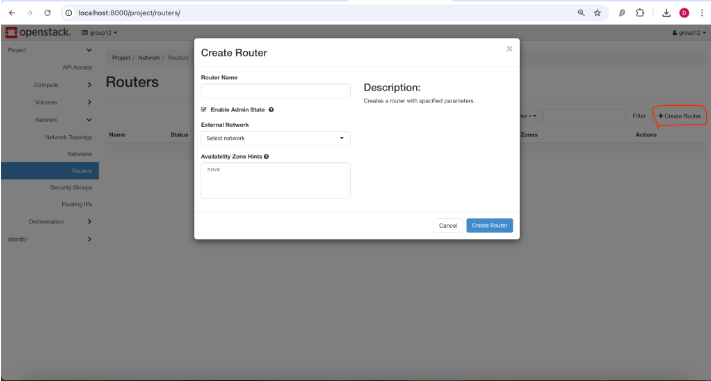
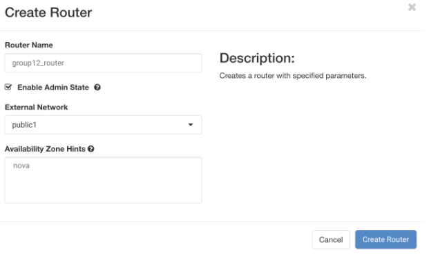
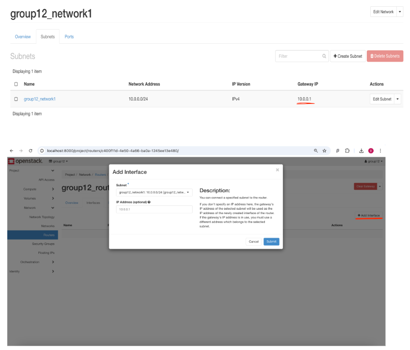
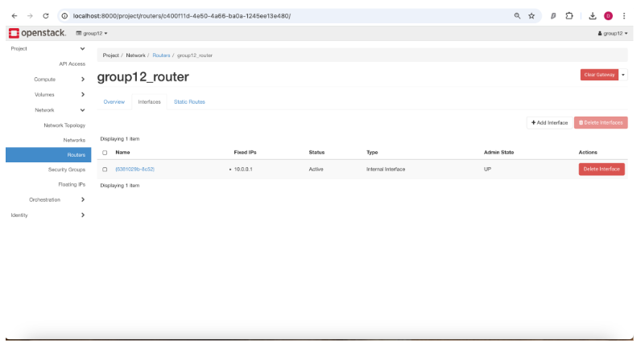

# Homework 1

## This page contains all of the Jira notes from HW-1

Below are all of the Jiras from HW1, as well as well as the notes left for each step.

### OSP-1: Create Virtual Network in OpenStack

Completed by: Terence Goosby

**Steps Taken to Complete Task:**

1. Navigate to the Project > Network > Networks tab in OpenStack

2. Click on the Create Network Button

3. Enter the name of the network (e.g., I typed group12_network1)

4. Select the Network’s Admin State UP and Create a Subnet

5. Enter the Subnet Name (e.g., I typed group12_network1)

6. Enter the network address - 10.0.0.0/24

7. Enter the Gateway IP - 10.0.0.1

8. Leave DHCP Enabled

9. Enter Allocation Pools - (First Line) 10.0.0.2,10.0.0.100 (Second Line) 10.0.0.150,10.0.0.200

10. (Optional) Enter a DNS Server Address - 8.8.8.8

### OSP-2: Create Virtual Router in OpenStack and Attach Virtual Network

Completed By: Andrew Moon

#### Step 1: Navigate to Network > Routers, and select "+ Create Router"

Give the Router a name, if “Enable Admin State” is checked, the router will be
enabled. From the slides: “UP = enabled; DOWN = disabled”. “External Network”
only has one option; public1. This allows us to access the internet.

Then you are good to click “Create Router”

#### Step 2: Attaching the internal network to the router

Select the router created, and navigate to the interfaces tab. Click the add
interface button. After the add interface tab opens, select the subnet/internal
network we created (group12_network1), and provide the gateway IP of the
subnet in the IP address field.

Then you should be good to submit the interface, and we should now have a
working network to use in our vms.

Result:

